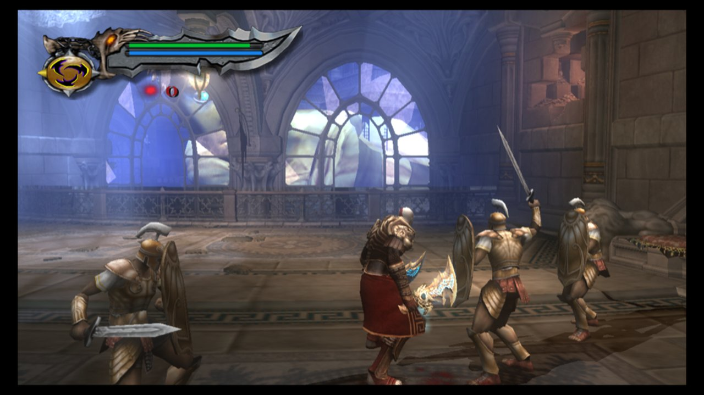
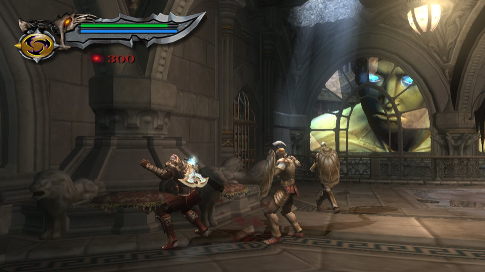
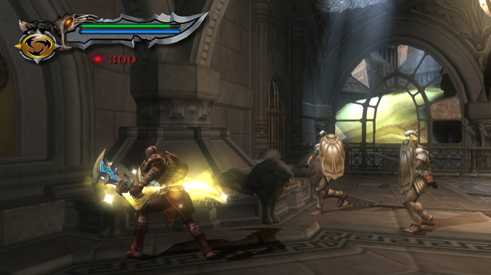
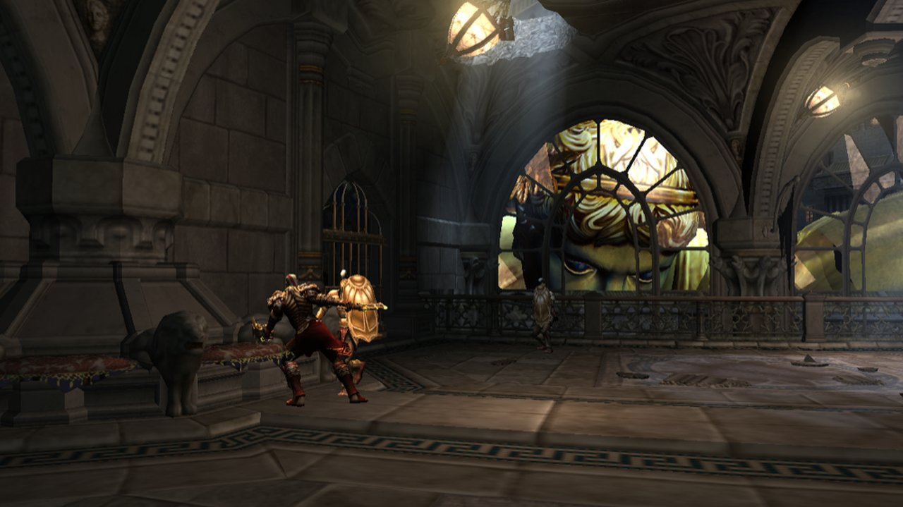
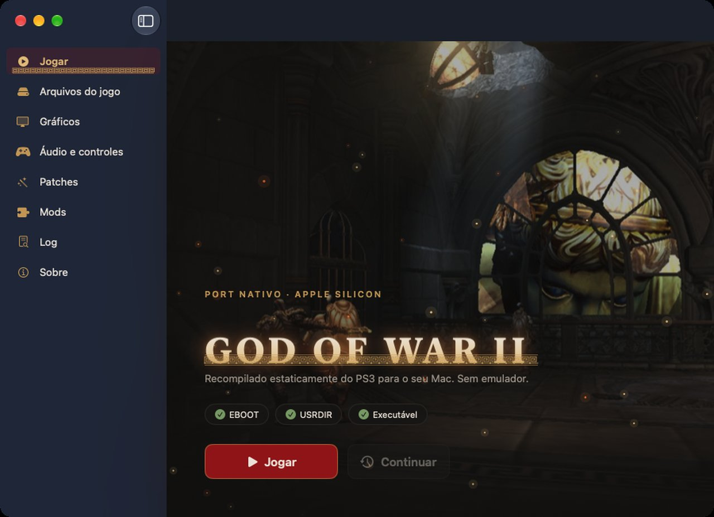

# God of War II HD — native macOS port by static recompilation

**God of War II HD** (PS3, `NPUA80491`) running **natively on Apple Silicon**:
no emulator, no JIT. The PowerPC (PPU) and Cell SPU code is translated ahead
of time into C/C++, compiled with clang for arm64, and runs on a
reimplementation of the PS3 OS and libraries with **Metal** for graphics,
**VideoToolbox** for cutscenes and **CoreAudio** for sound.

> This repository contains **no game code and no game assets**. Like
> [Dusk](https://duskport.com/dusk/), you bring your own legally dumped copy,
> and the setup kit decrypts, translates and builds it **on your machine**.

| | |
|---|---|
|  |  |
|  |  |

*Captured from the native Metal renderer on an M-series Mac (1280×720 internal,
MetalFX upscaled).*

---

## Status

| Area | State |
|---|---|
| Boot, intro videos, logos | ✅ natural path, videos decoded by VideoToolbox |
| Main menu, New Game, saves | ✅ memory-card saves on disk |
| Rhodes gameplay (combat, HUD, particles, lighting) | ✅ 45–60 fps on Apple Silicon |
| Colossus of Rhodes fight | 🟡 playable; the bronze drape on its shoulder is skinned with a sheared bone matrix (under investigation) |
| After the Colossus cutscene | 🔴 a script virtual call jumps to an invalid target (`ICALL-BAD 0x80029F47`); regression window narrowed to 2026-09-20 |
| Audio | 🟡 music/SFX through the SCREAM mixer SPU program; clock still partly host-driven |
| Controllers | ✅ DualShock 4 / DualSense / Xbox / MFi via GameController, keyboard + mouse |

The engineering log (every wall, the hypotheses refuted by measurement and the
fixes) lives in [`docs/`](docs/) and in the engine repository.

## How it works

```
EBOOT.ELF (your copy, decrypted)
   │
   ├── PPU  ── ppu_lifter.py ──► ~650 C++ chunks, 69k functions ──┐
   │          (functions.json: curated function bounds,           │
   │           jump tables, mid-function entry points)            │
   │                                                               ├─► clang -O1/-O2 arm64 ─► g2play
   └── SPU  ── spu_lifter.py ──► SPU jobs / SPURS policy modules ─┘            │
                                                                                ▼
                               ps3recomp runtime (MIT): LV2 syscalls, PPU threads,
                               lwmutex/lwcond, SPURS, FIOS, cellGcm → RSX FIFO walker
                               → Metal backend (MSL from RSX VP/FP), cellVdec → VideoToolbox,
                               cellAudio → CoreAudio, cellPad → GameController
```

What makes a PS3 title hard to recompile, and what this port had to solve:

- **Cell B.E.**: one PPU plus up to six SPUs with their own ISA and 256 KB local
  store; SPU programs (SPURS workloads, job chains, policy modules) are lifted
  separately and scheduled on host threads.
- **Indirect control flow**: 64-bit PowerPC function descriptors (`.opd`/TOC),
  vtables, computed `bctr` jump tables and mid-function entries, all of which
  the lifter must resolve statically.
- **RSX**: the command FIFO (with CALL/JUMP, wait points and ring wraps) is
  walked on the host, and the NV40-class vertex/fragment programs are
  decompiled to Metal Shading Language.
- **Faithfulness over shortcuts**: fixes follow console behaviour (RPCS3 is
  used as a measurement oracle via its GDB stub); diagnostics are gated off by
  default.

## Launcher (macOS)



`GoW2 Recomp.app` is a native SwiftUI launcher in the spirit of Dusk:
point it at your own `EBOOT.ELF` and `USRDIR`, pick graphics/audio/control
options, manage mods and play. Build it with:

```
launcher/macos/build_app.sh     # -> ./GoW2 Recomp.app
```

- **No Python, no interpreter**: validation, config, autosave checks (SHA-256
  per file) and mod import run in Swift inside the app.
- **RPCS3-style patches**: the launcher computes your executable's RPCS3 PPU
  hash by streaming the ELF (for NPUA80491 01.00 it is
  `PPU-31e32090ea333902dbf322c24487bab7e8c8d0d1`), reads RPCS3's
  `patch.yml` (anchors, aliases, configurable values) or any `.yml` you
  import, and passes the enabled ones to the runtime (`PS3_PATCH_FILE`). Data
  patches (e.g. aspect ratio) take effect; code patches are flagged, because
  the code was already recompiled and would need a re-lift.
- Design system in [`launcher/macos/MASTER.md`](launcher/macos/MASTER.md).

## Bring your own game (macOS kit)

A [Dusk](https://duskport.com/dusk/)-style kit: point it at your own game
folder (`PS3_GAME`, from RPCS3's `dev_hdd0/game/NPUA80491` or your PS3) and
your license (`UP9000-NPUA80491_00-GODOFWARIIHDUS00.rap`), and it builds the
native binary on your Mac:

```bash
./kit/setup.sh /path/to/PS3_GAME        # finds the .rap in RPCS3's exdata or ~/Downloads
./jogar_g2.sh
```

`setup.sh` does the following:

1. It decrypts `EBOOT.BIN` itself, the same way RPCS3 does (engine
   `tools/unself`).
2. It recompiles the PPU code with the pinned lifter, the patch scripts and a
   small delta.
3. It recompiles the seven SPU programs.
4. It extracts the movies from your `gow2.psarc`.
5. It links `./g2play`.

Every generated file is checked against the hashes in `kit/`. The result is
byte-identical to the build the project tests. Details are in
[`kit/README.md`](kit/README.md).

Controls: WASD move, mouse camera, Space/E/J/K = ✕/○/□/△, Enter = Start,
F11 or Cmd+Enter = fullscreen, Esc releases the mouse.

## State of the art in game recompilation

| Project | Platform | Approach | Notable result |
|---|---|---|---|
| [N64Recomp](https://github.com/N64Recomp/N64Recomp) | Nintendo 64 (MIPS) | Static recompilation to C | *Zelda 64: Recompiled* and many more; modding framework |
| [XenonRecomp](https://github.com/hedge-dev/XenonRecomp) | Xbox 360 (PowerPC) | Static recompilation to C++ | *Unleashed Recompiled*, the first 360 recomp playable start to finish |
| ReXGlue | Xbox 360 | Static recompilation | Tooling for 360 ports |
| PS2Recomp | PlayStation 2 (MIPS R5900) | Static recompilation | Early stage |
| [psprecomp](https://github.com/sp00nznet/psprecomp) | PSP (Allegrex MIPS) | Static recompilation to C | Toolkit |
| [ps3recomp](https://github.com/sp00nznet/ps3recomp) | PlayStation 3 (PPU) | Static recompilation runtime | The base of this port's engine |
| **This port** | **PlayStation 3 (PPU + SPU)** | **Static recompilation, PPU and SPU, native Metal** | **A commercial PS3 title in gameplay on macOS/arm64** |
| [Dusk / Dusklight](https://duskport.com/) | GameCube | Decompilation (source rebuilt by hand) | *Twilight Princess* native port; you supply the ISO |
| [RPCS3](https://rpcs3.net/) | PlayStation 3 | Emulation (LLVM JIT/AOT) | The reference used here as an oracle |

Catalogs: [Recompendium](https://nio03.github.io/unricopie/en/),
[decompilation & recompilation list](https://readonlymemo.com/decompilation-projects-and-n64-recompiled-list/).

Static recompilation sits between emulation and decompilation: like a
decompilation it produces native code with no interpreter or JIT (so it can
use native APIs such as Metal directly), but like an emulator it needs no
hand-written game source. It only needs the original binary, which is why the
user has to supply it.

## Repository layout

- `functions.json` — curated PPU function bounds (truncation repairs,
  mid-function targets).
- `recomp_mid_v2/` — hand-written glue: SPU workload registration, function
  overrides, mid-asm hooks, and the idempotent `patch_*.py` scripts that must
  survive every re-lift.
- `config/gow2_recomp.toml` — lifter configuration (hooks).
- `jogar_g2.sh`, `env_gow2.sh`, `gow2_launcher.py` — launcher and environment.
- `docs/` — design notes and investigation logs.

Excluded on purpose (see `.gitignore`): `EBOOT.ELF`, `extracted/`, `*.psarc`,
SPU images, lifted PPU/SPU sources, texture dumps and build output. Those are
derived from the game and are regenerated from your own copy.

## Legal

God of War II is © Sony Interactive Entertainment. This project is not
affiliated with or endorsed by Sony. It distributes no copyrighted game code
or assets; you must own the game. The engine is MIT licensed
(© sp00nznet and contributors).

---

### Em português

Port nativo de **God of War II HD** (PS3) para **macOS/Apple Silicon** por
**recompilação estática**: o código PowerPC e SPU do jogo é traduzido para
C/C++ e compilado para arm64, rodando sobre uma reimplementação do sistema do
PS3 com Metal, VideoToolbox e CoreAudio. Nenhum código ou arquivo do jogo é
distribuído: como no Dusk, você fornece sua própria cópia e o kit de
instalação (`kit/setup.sh`) descriptografa, traduz e compila tudo na sua máquina.
