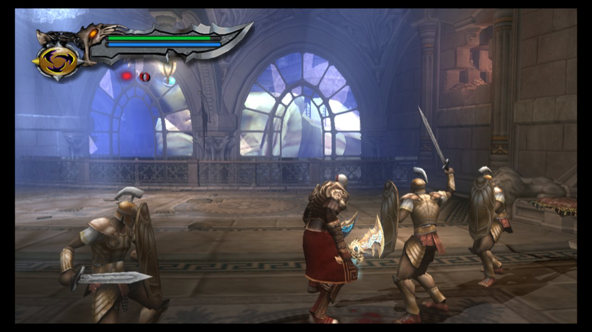
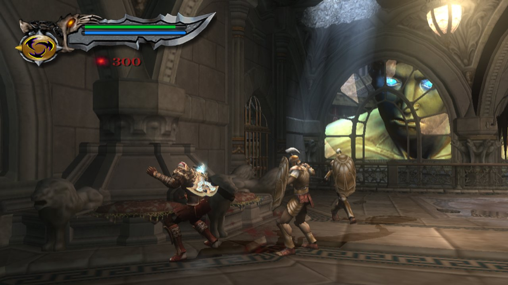
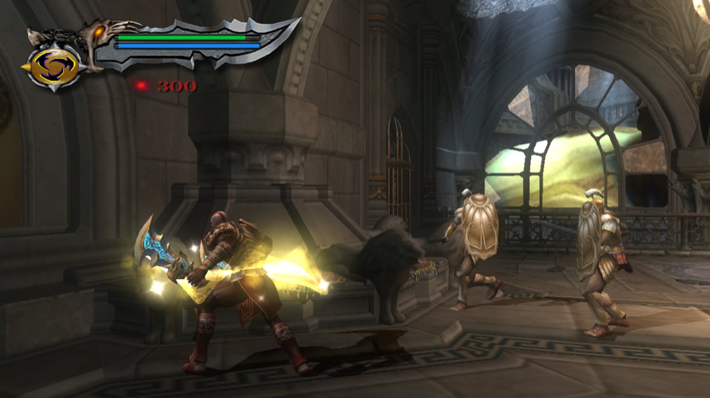
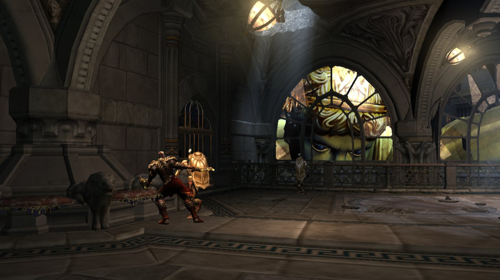
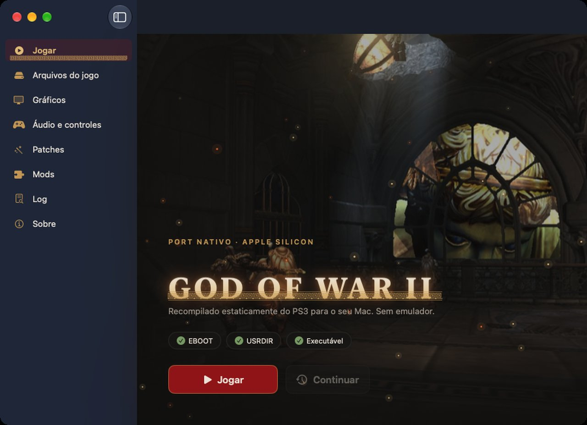

# God of War II HD — native macOS port by static recompilation

**God of War II HD** (PS3, `NPUA80491`) running **natively on Apple Silicon**:
no emulator, no JIT. The PowerPC (PPU) and Cell SPU code is translated ahead
of time into C/C++, compiled with clang for arm64, and runs on a
reimplementation of the PS3 OS and libraries with **Metal** for graphics,
**VideoToolbox** for cutscenes and **CoreAudio** for sound.

> This repository contains **no game code and no game assets**. Like
> [Dusk](https://duskport.com/dusk/), you bring your own legally dumped copy,
> and the setup kit decrypts, translates and builds it **on your machine**.

| | |
|---|---|
|  |  |
|  |  |

*Captured from the native Metal renderer on an M-series Mac (1280×720 internal,
MetalFX upscaled).*

---

## Status

| Area | State |
|---|---|
| Boot, intro videos, logos | ✅ natural path, videos decoded by VideoToolbox |
| Main menu, New Game, saves | ✅ memory-card saves on disk |
| Rhodes gameplay (combat, HUD, particles, lighting) | ✅ 45–60 fps on Apple Silicon (Mac, Metal; measured numbers in [Estado por plataforma e desempenho](#estado-por-plataforma-e-desempenho-2026-10-02)) |
| Colossus of Rhodes fight | 🟡 playable; the bronze drape on its shoulder is skinned with a sheared bone matrix (under investigation) |
| After the Colossus cutscene | ✅ fixed 2026-09-22: a lifted SPU program (spu1) was writing into the PPU code segment, which produced `ICALL-BAD 0x80029F47`; validated with 305 s of New Game → gameplay, 0 ICALL-BAD ([log](https://github.com/andrebrumdev/ps3recomp/blob/spurs-bringup/docs/re_sessions/2026-09-22-spu1-6074-texto-corrompido.md)) |
| iOS (iPhone) and Android (tablet) | 🟡 experimental; see [Estado por plataforma e desempenho](#estado-por-plataforma-e-desempenho-2026-10-02) (pt-BR) |
| Audio | 🟡 music/SFX through the SCREAM mixer SPU program; clock still partly host-driven |
| Controllers | ✅ DualShock 4 / DualSense / Xbox / MFi via GameController, keyboard + mouse |

The engineering log (every wall, the hypotheses refuted by measurement and the
fixes) lives in [`docs/`](docs/) and in the engine repository.

## How it works

```
EBOOT.ELF (your copy, decrypted)
   │
   ├── PPU  ── ppu_lifter.py ──► ~650 C++ chunks, 69k functions ──┐
   │          (functions.json: curated function bounds,           │
   │           jump tables, mid-function entry points)            │
   │                                                               ├─► clang -O1/-O2 arm64 ─► g2play
   └── SPU  ── spu_lifter.py ──► SPU jobs / SPURS policy modules ─┘            │
                                                                                ▼
                               ps3recomp runtime (MIT): LV2 syscalls, PPU threads,
                               lwmutex/lwcond, SPURS, FIOS, cellGcm → RSX FIFO walker
                               → Metal backend (MSL from RSX VP/FP), cellVdec → VideoToolbox,
                               cellAudio → CoreAudio, cellPad → GameController
```

What makes a PS3 title hard to recompile, and what this port had to solve:

- **Cell B.E.**: one PPU plus up to six SPUs with their own ISA and 256 KB local
  store; SPU programs (SPURS workloads, job chains, policy modules) are lifted
  separately and scheduled on host threads.
- **Indirect control flow**: 64-bit PowerPC function descriptors (`.opd`/TOC),
  vtables, computed `bctr` jump tables and mid-function entries, all of which
  the lifter must resolve statically.
- **RSX**: the command FIFO (with CALL/JUMP, wait points and ring wraps) is
  walked on the host, and the NV40-class vertex/fragment programs are
  decompiled to Metal Shading Language.
- **Faithfulness over shortcuts**: fixes follow console behaviour (RPCS3 is
  used as a measurement oracle via its GDB stub); diagnostics are gated off by
  default.

## Launcher (macOS)



`GoW2 Recomp.app` is a native SwiftUI launcher in the spirit of Dusk:
point it at your own `EBOOT.ELF` and `USRDIR`, pick graphics/audio/control
options, manage mods and play. Build it with:

```
launcher/macos/build_app.sh     # -> ./GoW2 Recomp.app
```

- **No Python, no interpreter**: validation, config, autosave checks (SHA-256
  per file) and mod import run in Swift inside the app.
- **RPCS3-style patches**: the launcher computes your executable's RPCS3 PPU
  hash by streaming the ELF (for NPUA80491 01.00 it is
  `PPU-31e32090ea333902dbf322c24487bab7e8c8d0d1`), reads RPCS3's
  `patch.yml` (anchors, aliases, configurable values) or any `.yml` you
  import, and passes the enabled ones to the runtime (`PS3_PATCH_FILE`). Data
  patches (e.g. aspect ratio) take effect; code patches are flagged, because
  the code was already recompiled and would need a re-lift.
- Design system in [`launcher/macos/MASTER.md`](launcher/macos/MASTER.md).

## Bring your own game (macOS kit)

A [Dusk](https://duskport.com/dusk/)-style kit: point it at your own game
folder (`PS3_GAME`, from RPCS3's `dev_hdd0/game/NPUA80491` or your PS3) and
your license (`UP9000-NPUA80491_00-GODOFWARIIHDUS00.rap`), and it builds the
native binary on your Mac:

```bash
./kit/setup.sh /path/to/PS3_GAME        # finds the .rap in RPCS3's exdata or ~/Downloads
./jogar_g2.sh
```

`setup.sh` does the following:

1. It decrypts `EBOOT.BIN` itself, the same way RPCS3 does (engine
   `tools/unself`).
2. It recompiles the PPU code with the pinned lifter, the patch scripts and a
   small delta.
3. It recompiles the seven SPU programs.
4. It extracts the movies from your `gow2.psarc`.
5. It links `./g2play`.

Every generated file is checked against the hashes in `kit/`. The result is
byte-identical to the build the project tests. Details are in
[`kit/README.md`](kit/README.md).

Controls: WASD move, mouse camera, Space/E/J/K = ✕/○/□/△, Enter = Start,
F11 or Cmd+Enter = fullscreen, Esc releases the mouse.

## State of the art in game recompilation

| Project | Platform | Approach | Notable result |
|---|---|---|---|
| [N64Recomp](https://github.com/N64Recomp/N64Recomp) | Nintendo 64 (MIPS) | Static recompilation to C | *Zelda 64: Recompiled* and many more; modding framework |
| [XenonRecomp](https://github.com/hedge-dev/XenonRecomp) | Xbox 360 (PowerPC) | Static recompilation to C++ | *Unleashed Recompiled*, the first 360 recomp playable start to finish |
| ReXGlue | Xbox 360 | Static recompilation | Tooling for 360 ports |
| PS2Recomp | PlayStation 2 (MIPS R5900) | Static recompilation | Early stage |
| [psprecomp](https://github.com/sp00nznet/psprecomp) | PSP (Allegrex MIPS) | Static recompilation to C | Toolkit |
| [ps3recomp](https://github.com/sp00nznet/ps3recomp) | PlayStation 3 (PPU) | Static recompilation runtime | The base of this port's engine |
| **This port** | **PlayStation 3 (PPU + SPU)** | **Static recompilation, PPU and SPU, native Metal** | **A commercial PS3 title in gameplay on macOS/arm64** |
| [Dusk / Dusklight](https://duskport.com/) | GameCube | Decompilation (source rebuilt by hand) | *Twilight Princess* native port; you supply the ISO |
| [RPCS3](https://rpcs3.net/) | PlayStation 3 | Emulation (LLVM JIT/AOT) | The reference used here as an oracle |

Catalogs: [Recompendium](https://nio03.github.io/unricopie/en/),
[decompilation & recompilation list](https://readonlymemo.com/decompilation-projects-and-n64-recompiled-list/).

Static recompilation sits between emulation and decompilation: like a
decompilation it produces native code with no interpreter or JIT (so it can
use native APIs such as Metal directly), but like an emulator it needs no
hand-written game source. It only needs the original binary, which is why the
user has to supply it.

## Repository layout

- `functions.json` — curated PPU function bounds (truncation repairs,
  mid-function targets).
- `recomp_mid_v2/` — hand-written glue: SPU workload registration, function
  overrides, mid-asm hooks, and the idempotent `patch_*.py` scripts that must
  survive every re-lift.
- `config/gow2_recomp.toml` — lifter configuration (hooks).
- `jogar_g2.sh`, `env_gow2.sh`, `gow2_launcher.py` — launcher and environment.
- `docs/` — design notes and investigation logs.

Excluded on purpose (see `.gitignore`): `EBOOT.ELF`, `extracted/`, `*.psarc`,
SPU images, lifted PPU/SPU sources, texture dumps and build output. Those are
derived from the game and are regenerated from your own copy.

## Legal

God of War II is © Sony Interactive Entertainment. This project is not
affiliated with or endorsed by Sony. It distributes no copyrighted game code
or assets; you must own the game. The engine is MIT licensed
(© sp00nznet and contributors).

O APK para Android é compilado localmente a partir do seu próprio dump e instalado somente no seu próprio aparelho; ele nunca é distribuído. As bibliotecas do FFmpeg dentro do app continuam sob a LGPL-2.1 e podem ser copiadas, modificadas e substituídas.

---

### Em português

Port nativo de **God of War II HD** (PS3) para **macOS/Apple Silicon** por
**recompilação estática**: o código PowerPC e SPU do jogo é traduzido para
C/C++ e compilado para arm64, rodando sobre uma reimplementação do sistema do
PS3 com Metal, VideoToolbox e CoreAudio. Nenhum código ou arquivo do jogo é
distribuído: como no Dusk, você fornece sua própria cópia e o kit de
instalação (`kit/setup.sh`) descriptografa, traduz e compila tudo na sua máquina.

O APK para Android é compilado localmente a partir do seu próprio dump e instalado somente no seu próprio aparelho; ele nunca é distribuído. As bibliotecas do FFmpeg dentro do app continuam sob a LGPL-2.1 e podem ser copiadas, modificadas e substituídas.

Full technical history lives in the Claude project memory (`ps3recomp-feasibility`,
levas 13-17) and in `ps3recomp/docs/`.

## Estado por plataforma e desempenho (2026-10-02)

Resumo das sessões de 2026-09-30 a 2026-10-02. Cada número diz **onde** foi medido e **com quantas
corridas**. Classes de evidência: **in-boot no aparelho** (jogo real no tablet ou no iPhone),
**Mac** (jogo real num MacBook; não vale para o tablet), **offline/unit** (testes sem o jogo) e
**não exercitado**. Os links apontam para o motor
([andrebrumdev/ps3recomp](https://github.com/andrebrumdev/ps3recomp), ramo `spurs-bringup`).

### Estado atual por plataforma

| Plataforma | Backend | Provado | Não provado / em aberto |
|---|---|---|---|
| **Mac** (Apple Silicon) | Metal | in-boot: boot → menu → gameplay de Rodes; 44–52 fps p50 no gameplay num M5 na tomada antes do merge (3 corridas por braço, [medição](https://github.com/andrebrumdev/ps3recomp/blob/spurs-bringup/docs/re_sessions/2026-10-02-mac-medicao-env-correto.md)) | depois do merge de 2026-10-02 só houve 3 corridas com a máquina carregada (load 4,7–14): 26–42 fps, sem valor de comparação; o portão de ~45 fps com a máquina ociosa **não foi refeito** ([merge](https://github.com/andrebrumdev/ps3recomp/blob/spurs-bringup/docs/re_sessions/2026-10-02-merge-para-spurs-bringup.md)) |
| **iOS** (iPhone 14) | Metal | in-boot em ramos anteriores: P2 de 2026-09-25 com p50 33 / p5 21 em 195 de 200 s de gameplay, 1 corrida, meta de p5 ≥ 25 não atingida ([P2](https://github.com/andrebrumdev/ps3recomp/blob/spurs-bringup/docs/superpowers/specs/2026-09-25-ios-p2-perf-milestone.md)) | o `spurs-bringup` depois do merge **não foi compilado nem rodado no iPhone** |
| **Android** (Galaxy Tab S9 FE, Mali-G68) | Vulkan | in-boot: gameplay com toque virtual; p50 12 / p5 11 no APK padrão depois do merge (1 corrida); cinemática de abertura a 29–30 fps | a thread do RSX com fragmentos (`PS3_RSX_FRAG`) dá 17/15, mas continua desligada por padrão (revisão independente pendente) |
| **Windows** | D3D12 | histórico de bring-up (paredes A–G no `CLAUDE.md` do motor) | **não compilado nem exercitado** nesta leva; lá `PS3_RSX_FIFO`, `PS3_VDEC_ASYNC`, `PS3_MOVIE_IO` e `PS3_SPU1` continuam opt-in; a correção do `recomp_mid_v2/build_d3d.sh` (`rsx_frame_notes.c` no link) está só no gow2-recomp |

### Desempenho medido — tablet (Galaxy Tab S9 FE)

In-boot, APK do `feat/gow2-android`, tablet no USB, `PS3_MUTE=1`, 100 s de gameplay por
`run_perf.sh --drive`, salvo indicação. Ruído entre corridas de ~±1 fps, **não caracterizado**.
Gargalo medido: a thread principal (PPU + walker do RSX inline) a ~87–91 % de um núcleo; a GPU
fica ~9 % ocupada ([GPU timing](https://github.com/andrebrumdev/ps3recomp/blob/spurs-bringup/docs/re_sessions/2026-10-01-android-gpu-timing-gameplay.md)).

| Mudança | Resultado (p50 / p5) | n | Fonte |
|---|---|---|---|
| Baseline → parar de reler memória Vulkan mapeada write-combined (`rsx_core_index_fetch`, `529f5962`) | 9 / 8 → 11 / 10 | 1 por ponto | [GPU timing](https://github.com/andrebrumdev/ps3recomp/blob/spurs-bringup/docs/re_sessions/2026-10-01-android-gpu-timing-gameplay.md) |
| + as outras leituras mapeadas por draw (`c0762b29`, `929f607a`) | **12 / 11** | 1 | idem |
| Cache de pipeline persistente (`551bc38e`) | `pso_ms` nos primeiros 60 s: 559 → 262 → **4** da 1.ª à 3.ª execução; fps 10/9 → 12/11 → 12/11 (a 1.ª execução é a mais lenta) | 1 série de 3 | idem |
| Thread dedicada do RSX (`PS3_RSX_THREAD=1`) sozinha | medianas 12 / 11 contra 12 / 11: **sem ganho consistente**; a Thread-2 cai ~15 pontos, a `host:rsx` gasta ~45 % de um núcleo e a PPU espera ~17 % de cada segundo no overflow | 3 pares | [thread RSX](https://github.com/andrebrumdev/ps3recomp/blob/spurs-bringup/docs/re_sessions/2026-10-02-tablet-ab-thread-rsx.md) |
| Thread + fragmentos de 32 KB (`PS3_RSX_FRAG=1`, etapa 3) | **17 / 15** contra 13 / 11 (3 de 3 pares a favor; espera de overflow 156–207 → 0 ms/s); na ponta do merge, 17 / 15 em 1 corrida | 3 pares + 1 | [FRAG](https://github.com/andrebrumdev/ps3recomp/blob/spurs-bringup/docs/re_sessions/2026-10-02-tablet-ab-frag-etapa3.md) |
| Interpretador SPU S0–S2 | CPU dos 6 workers SPURS −8 % (2368 → 2178 ms/s), interpretador −23 %, processo −5,4 %; **fps igual** (12 / 11); áudio sem regressão (3 pares com som) | PRE 5, S2 3 | [SPU S0–S2](https://github.com/andrebrumdev/ps3recomp/blob/spurs-bringup/docs/re_sessions/2026-10-02-tablet-ab-spu-s0s2.md) |
| Dedup de comandos do replay Vulkan (`PS3_VK_REPLAY_DEDUP`, ligado por padrão) | ON 12/11 e 12/11, OFF 12/10 e 11/10: inconclusivo, compatível com um ganho pequeno | 2 pares | [GPU timing](https://github.com/andrebrumdev/ps3recomp/blob/spurs-bringup/docs/re_sessions/2026-10-01-android-gpu-timing-gameplay.md) |
| Vídeo da cinemática de abertura | 29–30 fps estáveis com e sem som; os 5–6 fps de uma corrida anterior **não se reproduziram** (causa não identificada) | 2 | idem |

**Medido sem ganho no tablet** (não repetir sem motivo novo): número de workers SPURS (2, 3 ou 6:
9–10 fps, 1 corrida cada); afinidade nos núcleos grandes (`PS3_ANDROID_BIG_CORES` 1/2: 9/7 e 9/8;
o modo 3, PPU sozinha num núcleo, piora para 7/6); lift com `-O2` (12/11, igual ao `-O1`, 2 corridas);
desvirtualização das chamadas indiretas (ON 12/11 e 12/11, OFF 12/11 e 13/12, 2 pares,
[devirt](https://github.com/andrebrumdev/ps3recomp/blob/spurs-bringup/docs/re_sessions/2026-10-01-android-devirt-merge.md));
a terceira leva de otimizações da thread principal (12/11 antes e depois); o dedup de
descritores/estado (acima, inconclusivo).

### Desempenho medido — Mac (MacBook M5, não vale para o tablet)

Jogo real, na tomada, janela oculta, mudo, 3 corridas por braço alternadas, janela de 60 s de
gameplay ([medição](https://github.com/andrebrumdev/ps3recomp/blob/spurs-bringup/docs/re_sessions/2026-10-02-mac-medicao-env-correto.md)).

| Mudança | Resultado | Leitura |
|---|---|---|
| Interpretador SPU S0–S2 (Metal) | fps p50 **48 [47..52] contra 44 [43..46]**; workers −7 %, interpretador −12 %; áudio igual | ganho medido no Mac; no tablet o mesmo código não muda o fps |
| Thread do RSX (Vulkan via MoltenVK) | 58 [56..59] contra 46 [46..47] | o backend de produção do Mac é o Metal, e a thread recusa o Metal: **não vale para o Mac distribuído** |
| `PS3_RSX_DRAIN=1 PS3_GCM_FIFO_NOLOCK=1` (Metal) | 48 contra 48 | sem ganho; fica desligado |
| Desvirtualização das chamadas indiretas | −13 % de CPU por quadro (64,0 → 58,1 ms), 44 → 47 fps | medido no Mac; no tablet, sem ganho ([devirt](https://github.com/andrebrumdev/ps3recomp/blob/spurs-bringup/docs/re_sessions/2026-10-01-android-devirt-merge.md)) |

A "regressão" de 10 fps no Mac de 2026-10-01 **não era código**: um binário de antes das
promoções de ambiente rodou sem as 9 variáveis que ele ainda precisava (abaixo); o mesmo binário
faz 48 fps com elas ([bisect](https://github.com/andrebrumdev/ps3recomp/blob/spurs-bringup/docs/re_sessions/2026-10-02-bisect-regressao-fps-mac.md)).

### Experimentos e variáveis de ambiente

Conferidas no código do `spurs-bringup`. Sondas e experimentos ficam desligados por padrão.

| Variável | Padrão | O que faz | Estado |
|---|---|---|---|
| `PS3_RSX_THREAD=1` | desligada | walker do FIFO do RSX numa thread própria (`host:rsx`) | experimental; só com backend Vulkan (recusada no Metal, inexistente no Windows) |
| `PS3_RSX_FRAG=1` | desligada | contexto padrão em fragmentos de 32 KB como a libgcm (etapa 3); só vale com `PS3_RSX_THREAD=1` | experimental; o maior ganho medido no tablet; revisão independente pendente |
| `PS3_TRACE_RSXT=1` | desligada | sonda `[RSXT]`: tempos de walk/parse/draw, esperas, kicks | sonda |
| `PS3_TRACE_SPU_INTERP=1` | desligada | sonda `[SPUISTAT]` do interpretador SPU | sonda; troca o laço rápido pelo instrumentado (`spui_run_instr`, ~56 ms/s mais caro no tablet): não mede o laço de produção |
| `PS3_SPU_INTERP=0` | ligado (1) | volta a imagem 7 (mixer SCREAM) ao spu6 liftado | A/B |
| `PS3_TRACE_VDEC_PIPE=1` | desligada | sonda `[VDECPIPE]`, uma linha por segundo com filme tocando | sonda |
| `PS3_VK_GPU_TIMING=1` | desligada | tempo de GPU por passe (`[GPUTIME]`) | sonda |
| `PS3_VK_PCACHE=0` | ligado | `=0` desliga o cache de pipeline em disco (precisa do diretório de cache) | padrão ligado, provado no Mali-G68 |
| `PS3_VK_REPLAY_DEDUP=0` | ligado | `=0` desliga o dedup de comandos repetidos do replay Vulkan | padrão ligado (ganho inconclusivo) |
| `PS3_VK_REPLAY_STATS=1` | desligada | contadores `[VKREPLAY]` | sonda |
| `PS3_ANDROID_BIG_CORES=1\|2\|3` | desligada (0) | afinidade da PPU/SPU nos núcleos grandes | medido sem ganho; código mantido |
| `PS3_SPU_WORKERS=N` | nº de SPUs pedido pelo jogo | número de workers SPURS | medido sem ganho no tablet |
| `PS3_HOST_PROFILE=1` | desligada | amostrador por SIGPROF (`[HPROF]`), só Linux/Android | ferramenta de medição |
| `PS3_ICALL_DEVIRT=0` | ligado | desliga os sítios desvirtualizados (só em lift construído com `ICALL_DEVIRT=1`, o padrão do `build_macos.sh`) | A/B |
| `PS3_ICALL_DEVIRT_CHECK=1` | desligada | recompara cada chamada desvirtualizada com o registro | diagnóstico |
| `PS3_RSX_DRAIN=1`, `PS3_GCM_FIFO_NOLOCK=1` | desligadas | dreno extra do FIFO / walker sem o lock | medido sem ganho no Mac |

Variáveis do harness: `PS3_MUTE=1` (sem som), `PS3_TRACE_FPS=1` (linhas `[FPS]`),
`PS3_WINDOW_HIDDEN=1` (janela oculta no Mac), `PS3_TRACE_AUDIO=1` (`[AUDIO]`).

### Como medir

- **Tablet:** `bash games/gow2/android/run_perf.sh OUT --seconds 100 --drive --env PS3_MUTE=1 [--env PS3_HOST_PROFILE=1] [--env K=V ...]`.
  `--drive` chama `android/drive_gameplay.sh` (toques reais por `adb` da tela inicial até o
  gameplay; para com um motivo em vez de girar); `--timed N --drive-newgame` deixa a cinemática de
  abertura tocar (medição de vídeo). O `report.md` sai do `ios/perf_report.py --tag ANDPERF`.
  O script sempre apaga o `gow2.override.env` do app e para o app ao sair. O `simpleperf` não
  funciona neste aparelho (`cpu-cycles` não suportado); use `PS3_HOST_PROFILE=1`.
- **Perfil por símbolo:** `python3 tools/mobile/hprof_report.py gow2.log libmain.so --window S E --top 400 [--check]`
  (no motor). Recusa um `libmain.so` com build-id diferente do log.
- **Mac:** `claude_runs/run_metrics.sh BIN SHA256 LOG SECS [PS3_X=v ...]` e
  `python3 claude_runs/metrics_report.py LOG...`; na tomada (`pmset -g batt`), mudo, sem outra
  instância do jogo aberta, e anotando a carga (`uptime`) no início.
- **Protocolo A/B:** o mesmo binário/APK quando o braço for só uma variável; ≥ 3 pares
  **alternados**; tablet no USB e Mac na tomada; mudo; dizer o n e as faixas (mín..máx); fps de
  uma corrida só não é veredito. Antes de um A/B, a skill
  [`changing-the-game-across-platforms`](https://github.com/andrebrumdev/ps3recomp/blob/spurs-bringup/.agents/skills/changing-the-game-across-platforms/SKILL.md).
- **Armadilha das 9 variáveis promovidas:** `PS3_RSX_FIFO`, `PS3_VDEC_ASYNC`, `PS3_MOVIE_IO`,
  `PS3_SPU1`, `PS3_SPU6`, `PS3_GCM_CB`, `PS3_METAL_PER_DRAW_RT`, `PS3_METAL_PASS_MERGE` e
  `PS3_METAL_GPU_DESWIZZLE` viraram padrão no código (Mac/iOS; no Android as que valem lá). O
  `env_gow2.sh` e o `claude_runs/run_metrics.sh` deste repositório **não as exportam mais**
  (gow2-recomp `b0a167d`). Num ramo que contém as promoções isso é o certo; num binário de **antes** delas,
  essa receita roda o jogo em modo degradado (no Mac, 10 fps em vez de 48). Para medir um binário
  antigo, exporte as 9. No Windows, `PS3_RSX_FIFO`, `PS3_VDEC_ASYNC`, `PS3_MOVIE_IO` e `PS3_SPU1`
  continuam lidas do ambiente.

### Android: compilar e instalar

O APK é compilado **a partir do monorepo** (motor + `games/gow2`), com este repositório como
`GOW2_WORK` (dados do jogo, `recomp_macos_e435/`, `spu_lifted/`):

```bash
cd ps3recomp                                         # o monorepo (ou um worktree dele)
GOW2_WORK=../gow2-recomp bash games/gow2/android/build_android.sh   # compila; última linha GOW2_ANDROID_APK=<apk>
bash tools/android/install_android.sh --serial <SERIAL>             # só instala o build-android/gow2.apk
bash tools/android/install_android.sh --data --serial <SERIAL>      # instala e copia EBOOT.ELF, USRDIR/ e movie_cache/
```

- Pré-requisitos: rodar `./build_macos.sh recomp_macos_e435` uma vez no Mac (aplica e confere os
  lifts SPU) e `tools/android/probe_transport.sh` uma vez com o aparelho.
- Opções do lift: `LIFT_OPT=-O1` (padrão; `-O2` medido sem ganho), `FORCE_REBUILD_LIFT=1`,
  `ICALL_DEVIRT=0` (lift sem desvirtualização; objetos em pasta separada).
- Nas máquinas de desenvolvimento há dois atalhos locais, fora do git (`build-android/` é
  ignorado): `run_build2.sh` chama o `build_android.sh` acima e **compila**; `run_install_apk.sh`
  chama o `install_android.sh` e **só instala** o APK que já existe.
- O APK é compilado do seu próprio dump e instalado só no seu aparelho; nunca é distribuído. As bibliotecas do FFmpeg dentro do app continuam sob a LGPL-2.1 e podem ser copiadas, modificadas e substituídas.

### iOS e Mac

- **Mac:** `./jogar_g2.sh` (ou o `GoW2 Recomp.app`); build com `./build_macos.sh` (no Mac o padrão
  é Metal). O `build_macos.sh` **não** recompila a biblioteca do motor: rode antes
  `cmake --build build-macos` no `ps3recomp`.
- **iOS:** `ios/build_ios.sh` assa o `env_gow2.sh` deste repositório no app. Com o motor do
  `spurs-bringup` (que já tem as promoções) isso é coerente; com um motor anterior às promoções o
  app cairia no modo degradado descrito acima (leitura de código, não verificado no aparelho).

### Os dois repositórios

- **[gow2-recomp](https://github.com/andrebrumdev/gow2-recomp)** é o checkout físico de
  build/run: fica ao lado dos dados do jogo (não versionados) e dos launchers.
- **[ps3recomp](https://github.com/andrebrumdev/ps3recomp)** (ramo `spurs-bringup`) é o monorepo:
  o motor (`runtime/`, `libs/`, `tools/`) e uma cópia deste port em `games/gow2/`.
- A sincronização é **por cópia**, nos dois sentidos, conferida blob a blob. A última foi do
  monorepo para cá em 2026-10-02 (Android, iOS, launcher, kit, testes:
  [port](https://github.com/andrebrumdev/ps3recomp/blob/spurs-bringup/docs/re_sessions/2026-10-02-port-games-gow2-para-gow2-recomp.md));
  as anteriores foram daqui para o monorepo. O APK é compilado do `games/gow2` do monorepo.
  Este README é igual nos dois lugares.

### Documentação e skills

| Documento (motor) | Assunto |
|---|---|
| [2026-10-01 GPU timing e gameplay no Android](https://github.com/andrebrumdev/ps3recomp/blob/spurs-bringup/docs/re_sessions/2026-10-01-android-gpu-timing-gameplay.md) | perfil da thread principal, leituras de memória mapeada, cache de pipeline, dedup, vídeo |
| [2026-10-01 desenho da thread do RSX](https://github.com/andrebrumdev/ps3recomp/blob/spurs-bringup/docs/re_sessions/2026-10-01-rsx-thread-design.md) | etapas 0–4, contrato de ordem e critérios de aborto |
| [2026-10-02 etapa 3 (fragmentos)](https://github.com/andrebrumdev/ps3recomp/blob/spurs-bringup/docs/re_sessions/2026-10-02-rsx-etapa3-fragmentos.md) | fragmentos de 32 KB, rodadas de revisão, mutantes |
| [2026-10-01 interpretador SPU](https://github.com/andrebrumdev/ps3recomp/blob/spurs-bringup/docs/re_sessions/2026-10-01-spu-jit-design.md) | desenho do S0–S2 (sem JIT) |
| [A/B thread do RSX](https://github.com/andrebrumdev/ps3recomp/blob/spurs-bringup/docs/re_sessions/2026-10-02-tablet-ab-thread-rsx.md), [A/B FRAG](https://github.com/andrebrumdev/ps3recomp/blob/spurs-bringup/docs/re_sessions/2026-10-02-tablet-ab-frag-etapa3.md), [A/B SPU S0–S2](https://github.com/andrebrumdev/ps3recomp/blob/spurs-bringup/docs/re_sessions/2026-10-02-tablet-ab-spu-s0s2.md) | medições no tablet |
| [Mac com o ambiente certo](https://github.com/andrebrumdev/ps3recomp/blob/spurs-bringup/docs/re_sessions/2026-10-02-mac-medicao-env-correto.md), [bisect do fps no Mac](https://github.com/andrebrumdev/ps3recomp/blob/spurs-bringup/docs/re_sessions/2026-10-02-bisect-regressao-fps-mac.md) | medições no Mac e a armadilha das variáveis promovidas |
| [Merge para o spurs-bringup](https://github.com/andrebrumdev/ps3recomp/blob/spurs-bringup/docs/re_sessions/2026-10-02-merge-para-spurs-bringup.md) | conflitos, matriz de paridade, verificação |
| [PRs de Vulkan do upstream](https://github.com/andrebrumdev/ps3recomp/blob/spurs-bringup/docs/re_sessions/2026-10-02-upstream-vulkan-prs-vs-nosso.md) | leitura (sem execução) dos PRs #182/#192 contra o nosso backend |
| Skill [`changing-the-game-across-platforms`](https://github.com/andrebrumdev/ps3recomp/blob/spurs-bringup/.agents/skills/changing-the-game-across-platforms/SKILL.md) | como levar uma mudança a Mac, iOS, Android e Windows com A/B e matriz de paridade |

### Em aberto

- Revisão independente (Codex) da etapa 3 da thread do RSX: incompleta; `PS3_RSX_FRAG` fica
  desligada por padrão até lá. Também falta comparar pixels com e sem FRAG.
- iOS: o `spurs-bringup` depois do merge não foi verificado no iPhone.
- Mac: o fps depois do merge não foi re-medido com a máquina ociosa.
- Windows: não compilado nesta leva; levar o `recomp_mid_v2/build_d3d.sh` do gow2-recomp para o
  monorepo.
- Tablet: o próximo ganho de fps está na thread principal (`vm_read*`, `ppu_rsv_*`, decode de
  vértices, FIFO), não no SPU.

## Central do jogo (PS/Home, Select+Start ou F1) e o launcher

`gow2_launcher.py` (setup + mods + "Jogar" numa tela só) também repassa as
configurações do overlay para o jogo. Esta seção documenta o overlay em si
(controles, onde ficam as configurações, o que cada diagnóstico significa) e
como ele se encaixa no fluxo do launcher.

**Importante:** o overlay é uma UI do host. Ele abrir/renderizar na tela **não
é prova** de que o jogo (guest) está desenhando pixels reais — essa aceitação
é separada (ver a cadeia de paredes A-G no `CLAUDE.md` do motor). Um print com
o menu aberto inclui a UI por cima do frame do jogo.

### Controles

- **Abrir/fechar a central:** botão **PS/Home** do controle (macOS, via
  GameController), **segure Select e aperte Start**, ou **F1** no teclado
  (`toggle_key=2` no arquivo troca para F2). A central sempre abre em
  **"Voltar ao jogo"** e o jogo continua rodando atrás dela, sem receber
  entrada. No Windows o botão PS/Home não é lido (XInput não o expõe):
  use Select+Start ou F1.
- **Navegação:** esquerda/direita troca de cartão; baixo (ou X/Enter) entra
  no painel; cima/baixo percorre as linhas; **X/Enter** confirma; **O/Esc**
  volta um nível e, nos cartões, fecha. PS/Home, Select+Start e F1 fecham
  de qualquer lugar. Um botão que ainda estiver pressionado quando a central
  fecha só chega ao jogo depois de solto (o X que confirmou "Voltar ao jogo"
  não vira pulo; o Enter não vira pausa).
- **Cartões:** Voltar ao jogo · Tela (tela cheia, VSync, tamanho da janela) ·
  Controles (zona morta 0–30 %, vibração do jogo, remapear botões, restaurar
  padrão) · Som (som do jogo, sons da interface, vibração da interface) ·
  Desenvolvedor (FPS/tempo de quadro, draws do jogo, estado do WAD, shaders,
  Logs) · Sair (pede confirmação; as configurações já estão salvas).
- **Remapear:** escolha o botão do PS3 na lista e pressione o botão do
  controle que deve acioná-lo; o antigo dono troca de lugar (o mapa nunca
  fica com botões repetidos). Esc cancela; sem resposta em 5 s, cancela.
- **Visual:** no macOS o jogo fica desfocado e escurecido atrás da central
  (Metal + MetalPerformanceShaders); no Windows só escurece. Texto em SF Pro
  e ícones SF Symbols no macOS; Inter (OFL, `third_party/inter`) e ícones
  geométricos no resto — ou se a fonte do sistema faltar.
- **Som do jogo** (menu) e **"Som ligado"** (launcher, `PS3_MUTE`) somam-se:
  o jogo só toca com os dois ligados.
- Valores não medidos aparecem como **"indisponível"** — nunca como zero.
- **O menu sempre inicia fechado.**

### Onde fica o arquivo de configurações

Local padrão por usuário (mesma fórmula usada pelo launcher e pelo runtime):

- **macOS:** `~/Library/Application Support/ps3recomp/gow2/runtime-overlay.settings`
- **Windows:** `%APPDATA%\ps3recomp\gow2\runtime-overlay.settings`
- **Linux:** `$XDG_CONFIG_HOME/ps3recomp/gow2/runtime-overlay.settings` (ou
  `~/.config/ps3recomp/gow2/runtime-overlay.settings` sem `XDG_CONFIG_HOME`)

Pode ser sobrescrito com a variável de ambiente `PS3_OVERLAY_SETTINGS`
(caminho explícito do arquivo). O `gow2_launcher.py` também aceita uma chave
opcional `"overlay_settings"` no `user_config.json`; vazia/ausente usa o
caminho padrão acima (configs antigas, sem essa chave, continuam funcionando
sem alteração). Se o arquivo estiver ausente, corrompido ou com um campo
inválido, o runtime cai de volta nos valores padrão desse campo (nunca
recusa iniciar por isso) — janela 1280x720, VSync ligado, mapeamento padrão.
Isso vale também para as chaves v2 (`ui_sounds`, `ui_haptics`, `game_mute`,
`vibration`): arquivos salvos por uma versão anterior do overlay, sem essas
chaves, carregam com os padrões (sons e vibração da interface ligados, som
do jogo ligado, vibração do jogo ligada).

### Precedência (variáveis de ambiente vs. configurações salvas)

**Tela cheia e VSync têm uma fonte só: o arquivo de configurações do
overlay.** O menu do jogo e o launcher SwiftUI (`GoW2 Recomp.app`) editam o
mesmo arquivo; o launcher não exporta mais `PS3_FULLSCREEN`/`PS3_METAL_VSYNC`
e passa o caminho em `PS3_OVERLAY_SETTINGS`. Na primeira execução do launcher
novo, um arquivo sem essas chaves recebe os valores que o launcher tinha
(padrão: ligados).

Um valor **explícito** ainda vence o arquivo: `PS3_FULLSCREEN`/
`PS3_METAL_VSYNC` definidos no ambiente de quem chamou (ou em "Avançado" no
launcher). O `env_gow2.sh` não força mais o VSync (só repassa o valor de quem
chamou). O `jogar_g2.sh`, o `gow2_launcher.py` e o launcher SwiftUI guardam o
valor do chamador antes de carregar o `env_gow2.sh` e removem a variável se
ele não definiu nada — nenhum padrão de script mascara o arquivo. O
`jogar_g2.sh` continua abrindo em **tela cheia** por padrão: se o arquivo
ainda não tem a chave `fullscreen`, ele grava `fullscreen=1` antes de iniciar
(depois vale o que a central salvar; `PS3_FULLSCREEN=0 ./jogar_g2.sh` abre em
janela só naquela vez). Arquivos gravados antes desta mudança podem já ter
`fullscreen=0`: basta ligar Tela cheia na central uma vez.

Se o launcher SwiftUI não conseguir gravar o arquivo, ele mostra na tela
"Não foi possível salvar as configurações: …" (com o motivo) em vez de
fingir que o ajuste mudou.

### Limitações por backend

| Ajuste | Metal (macOS) | D3D12 (Windows) |
|---|---|---|
| Tamanho de janela | aplica ao vivo | precisa reiniciar |
| Tela cheia | aplica ao vivo | precisa reiniciar (borderless no monitor primário, sem DPI awareness) |
| VSync | aplica ao vivo | aplica ao vivo |

A central marca cada ajuste que o backend atual não oferece como
"indisponível", e cada um que só vale depois de reiniciar mostra
"requer reiniciar" logo abaixo do nome — nenhum ajuste finge aplicar algo
que só foi salvo.

No Windows, hoje só o caminho de bridge D3D12 do `cellGcmSys.c` inicializa o
overlay; **não há ainda um provedor de diagnósticos de WAD/shader do GoW2
para Windows**, então as linhas de WAD e de shader aparecem como
"indisponível" lá (o overlay em si funciona; só falta o adaptador de
diagnóstico, que hoje só existe para o `boot_macos.cpp`).

### O que cada diagnóstico significa

- **FPS / tempo de frame:** contagem real da apresentação do backend — só os
  flips do jogo (guest). Apresentações do filme/intro (que correm na thread
  de decodificação) **não** entram nessa mesma contagem.
- **Draws do guest:** número de draw calls do próprio jogo, replays contados
  pelo backend — nunca inclui os draws do próprio menu do overlay. No Metal
  com os render targets por draw (padrão do runtime) os registros de
  clear e blit da mesma lista não entram na conta. No D3D12
  esse número é limitado a `MAX_DRAWS=256` por frame (registros reproduzidos,
  não o total real de draws se passar disso).
- **Shaders (hits/misses/compiles/failures):** "compiles" tem definição
  diferente por backend — no Metal é o número de pares VS+FS (vertex+
  fragment) compilados; no D3D12 é o número de compilações de fragment
  program bem-sucedidas. "Failures" conta decodificações/compilações que
  caíram para um caminho alternativo.
- **Estado do WAD / filme:** vem do caminho `movie_io` (ligado quando o
  diretório movie_cache existe); WADs lidos por outro caminho (psarc/FIOS
  direto) não aparecem aqui.
- **"Indisponível" nunca é "zero":** qualquer campo que o backend/provedor
  ainda não mediu aparece como "indisponível" (unavailable), nunca como `0`
  — um `0` no painel é sempre uma medição real de zero.
- **Log recente (aba Logs, separada da de Diagnóstico):** um anel limitado
  em memória (64 entradas; a aba mostra o anel inteiro, a mais nova por
  último); sob contenção alguma linha pode ser descartada (o registro nunca
  bloqueia a thread de render/guest para garantir isso).
- Se o backend não conseguir criar o renderer do overlay (ou a textura de
  fonte), o overlay se desliga sozinho para a sessão: F1/Select+Start não
  fazem nada e nenhuma entrada é retida do jogo (aviso
  `overlay disabled: ...` no `stderr`).

### Compatibilidade com launchers/scripts antigos

Arquivos `user_config.json` salvos antes do overlay continuam funcionando
sem qualquer alteração (a chave `overlay_settings` é opcional). Nenhum
comportamento de setup/extração/mods mudou.
